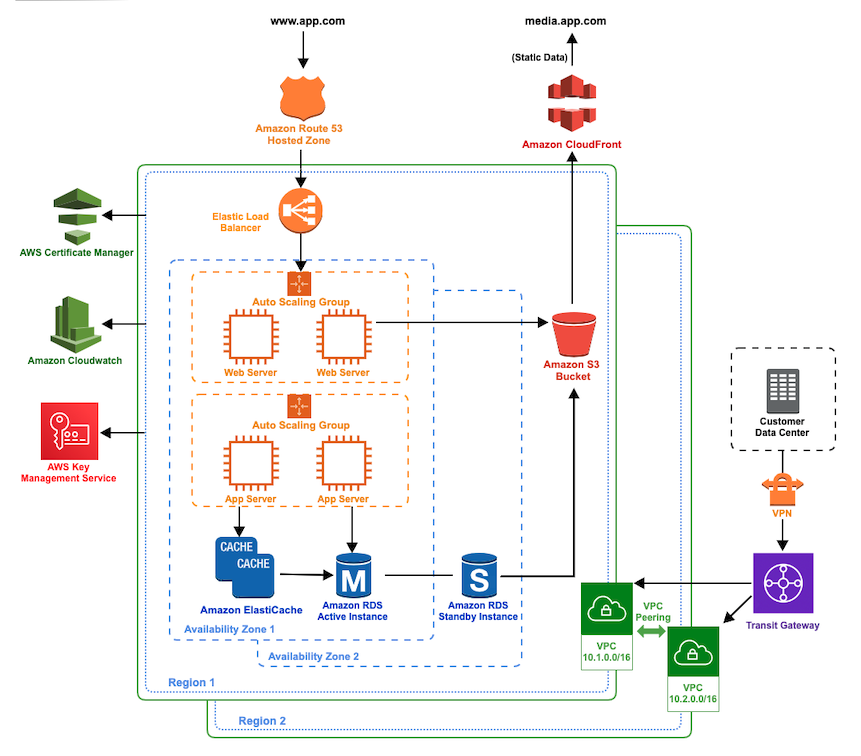

# Architecture Analysis

This analysis outlines recommended AWS products to meet the needs of the customer's application migration to the AWS platform. Addressed areas of concern include reliability, scalability,  security,  and cost-optimization. The referenced AWS products are EC2, RDS, S3, CloudFront, Route 53, Certificate Manager, Cloudwatch, Elasticache, and Elastic Load Balancer. A high-level architecture diagram depicts all aforementioned products.

#### Assumptions

- Customer has basic knowledge of Amazon Web Services products or is provided a supplemental document with acronym glossary and service definitions.
- "Bulk updates of customer information" will cause a relatively small set of data changes and not require ETL type processes.
- The term "shared content" is used to mean mixed media files that may be uploaded or downloaded by one or more customers through the application.
- Customer information and application data is stored in a relational database.
- Volumes that are locally attached to an instance are only used to host packages, configuration, or other files required to run the application process.

#### Architecture Diagram

- The customer data center is securely connected over VPN to the Transit Gateway.
- The application stack (web, app, & database layer) is replicated in multiple AZs and regions.
- EC2 instances are placed in auto scaling groups.
- Separate VPCs in different regions can communicate through VPC peering.

#### Reliability

- Redundancy of application stacks in multiple AZs and regions allows for fail over in disaster scenarios as well as high availability for end-users across the globe. Data residing on attached volumes is replicated between application stacks, allowing for low latency when the application needs to access it.
- S3 as the shared content storage enables high availability of objects. It is designed for 99.999999999% (11 9’s) of data durability because it automatically creates and stores copies of all S3 objects across multiple systems.
- RDS can be configured with active and standby instances across AZs and regions to support high availability. Automated backups and user initiated snapshots are two key features available to leverage for disaster recovery.
- AWS Auto Scaling can detect when an instance is unhealthy, terminate it, and launch an instance to replace it, maintaining a self-healing infrastructure.
- Elastic Load Balancing automatically distributes incoming traffic across multiple targets in multiple Availability Zones and ensures only healthy targets receive traffic. It can also load balance across a Region, routing traffic to healthy targets in different Availability Zones.

#### Scalability

- S3 is highly scalable and you only pay for what you use, you can start small and grow your application as you wish, with no compromise on performance or reliability.
- RDS instances can easily resized to accommodate for growth with little or no downtime.
- AWS Auto Scaling lets you set target utilization levels for multiple resources in a single interface and build scaling plans that automate how groups of different resources respond to changes in demand.
- Elastic Load Balancing is capable of handling rapid changes in network traffic patterns.
- The CloudFront content delivery network (CDN) is massively scaled and globally distributed. The CloudFront network has 216 points of presence (PoPs), and leverages the highly-resilient Amazon backbone network for superior performance and availability for your end users.

#### Security

- S3 is secure by default. Access control mechanisms such as bucket policies and Access Control List are available to increase security. Data can be security uploaded/downloaded via SSL endpoints using the HTTPS protocol. Extra security features include the Server-Side Encryption (SSE) option to encrypt data stored at rest and configuring the S3 buckets to automatically encrypt objects before storing them.
- RDS allows datbase encyryption using keys managed by AWS Key Management Service. On a database instance running with Amazon RDS encryption, data stored at rest in the underlying storage is encrypted, as are its automated backups, read replicas, and snapshots.
- Elastic Load Balancing provides integrated certificate management and SSL/TLS decryption, allowing the flexibility to centrally manage the SSL settings of the load balancer.
- AWS KMS uses hardware security modules to generate and protect keys. Keys are only used inside these devices and are never left unencrypted and never shared outside the AWS region in which they were created.
- Amazon CloudFront is a highly-secure CDN that provides both network and application level protection. Built-in protection of AWS Shield Standard is included as well as the configurable features such as AWS Certificate Manager to create and manage custom SSL certificates.
- AWS Certificate Manager is designed to protect and manage the private keys used with SSL/TLS certificates.
- AWS Transit Gateway is integrated with Identity and Access Management, enabling access management to AWS Transit Gateway securely. Using IAM, you can create and manage AWS users and groups, and use permissions to allow and deny their access to the AWS Transit Gateway. 

#### Cost-Optimization

- S3 is highly scalable and you only pay for what you use, you can start small and grow your application as you wish, with no compromise on performance or reliability.
- RDS has no up-front commitment; there is a monthly charge for each database instance that you launch. When the database instance is no longer needed, it can easily be deleted.
- Auto Scaling enables optimization for availability, costs, or a balance of both.  Only pay for the resources that are actually needed.
- KMS Keys created by you have a simple fee structure, where  AWS managed keys that are created on your behalf by AWS services are free to store.

#### Summary

AWS products are designed with resiliency, scalability, security, and cost-optimization in mind. Further exploration into the recommendation architecture will enable a deeper understanding of the requirements and solutions of the application migration to the AWS platform. 

